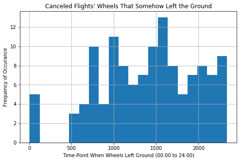
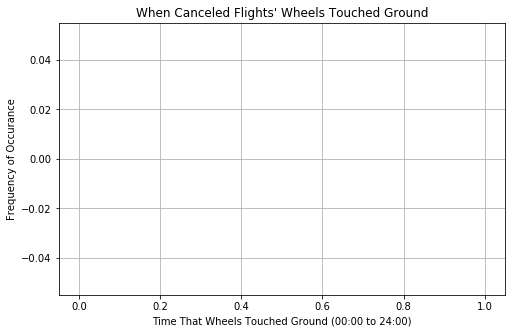

# Flight Delays and Cancellations Classifier

## Project Goal

The aim of this project was to build a binary classification model on a large dataset (i.e., no fewer than 30K observations and 15–40 features, at least two-thirds of which were numerical). After some searching, I decided on the [2015 Flight Delays and Cancellations](https://www.kaggle.com/usdot/flight-delays#flights.csv) dataset from Kaggle, and attempted to predict whether a flight will (1) depart at its scheduled time, or (2) be delayed or canceled.

While one could think of more than one way in which this might contribute some business value, I've hypothetically chosen to share my work with the leadership team of a mobile app development company that's creating an app for customers to know whether a given flight will be canceled or delayed—often before it's even announced by the airline—helping them to avoid wasted hours at an airport gate. The company's success hinges upon the app's ability to provide reliable, timely results to customers.

## Findings

At present, the **XGBoost** model leads all other competitors (Logistic Regression, Random Forest) in three out of four metrics. (Random Forest achieved *slightly* higher precision.):

* **Accuracy**: 91%
* **Precision**: 88%
* **Recall**: 75.3%
* **F1 Score**: 81.1%

A couple of notes on these results:

* The data shows that nearly 76% of flights in this analysis took off on-time (defined as departing less than five minutes behind schedule), while 24% departed at least five minutes behind schedule or were canceled. I address concerns of class imbalance in *Next Steps* below; for now, it should be noted that these metrics, especially Accuracy, have to be interpreted with this distribution in mind.

* Given the particular use-case for this project, it seems that Precision should be given primacy over Recall, since it would be better for a user to be told that their flight will depart on-time when it won't, than to be told that their flight would be delayed or canceled when it won't. Of course, Recall is nothing to be ignored; I want the model to precisely catch a *high rate* of the *total* canceled and delayed flights. But, the cost of missing a flight outweighs the potential reward of avoiding wait-times. So, when the model predicts a positive (in this case, a delayed/canceled flight), then it better be a True Positive!

## Data Sources

The dataset was downloaded from [Kaggle](https://www.kaggle.com/usdot/flight-delays#flights.csv), though originally collected and published by the United States Department of Transportation's (DOT) Bureau of Transportation Statistics.

As constituted, the dataset was much larger than I wished to work with (564.96 MB), which led to my decision to select from it a subset of all 2015 flights operated by three airlines from the United States: Delta, American Airlines, and US Airways. Even as such, the subset consisted of approximately 1.8 million unique flights, which, when it came to training a model, proved to be too computationally burdonsome on my machine.

My hasty *ad hoc* solution to this—and one which I wish to soon improve on—was to train my models on only a random sample of 50K flights from July of 2015. (More on this in the *Next Steps* section below.)

## Data Cleaning and EDA

The unprocessed data included 32 total features and 1,800,579 observations.

Some of the measures that I took in preprocessing the data:

- Removing irrelevant features
- Removing or imputing null values
- Removing extreme outliers
- Transforming categorical data through one-hot encoding and feature-hashing

The most important feature in my preferred model, for now, is `Arrival_Time`, though that's expected to change when planned improvements to the project are implemented (See *Next Steps*).

And of the many observations made during my EDA, one that stood out from the bunch was this strange discovery that some "canceled" flights—125 of them, to be exact—are actually recorded as having left the ground:

Though none of them, apparently, ever returned to the ground:

I Googled these historical flights, and, thankfully, found no evidence of foul play! Probably just an input error. But my Flatiron School instructor, who's very familiar with this dataset and knows many people who've worked with it, said he'd never seen this peculiarity before; so I thought I'd highlight it here.

## Data Preparation

## Modeling

## Evaluation

## Next Steps

## Repository Guide

## Repositary directory

The notebook found in `student.ipynb` records the start-to-finish Data Science Process, from preprocessing and exploration to modeling and interpreting.

The dataset is quite large as constituted (564.96 MB), which led to my decision to work with only a subset of it, limited to three major airlines from the United States: Delta, American Airlines, and US Airways. That subset can be found in `data/flights_us.csv`. A preprocessed version is saved as `data/flights_cleaned.csv`

A full list of features and their respective descriptions have been placed in the `columns.txt` file of this repository.

The inlcuded file `data/airlines.csv` provides full names of all airlines found in the original dataset, among which three are relevant to this project (AA, US, DL). This list is helpful as a means to matching each airport to its unique IATA code, as the dataset itself references airports by IATA code only.

Likewise, `data/airports.csv` provides full names of all airports found in the original dataset, along with each airport's IATA code.

In`presentation.pdf` you'll find the slide deck for a mock "executive summary" presentation that I prepared and delivered to the hypothetical stakeholder of my choosing. Here I describe my process and results in a non-technical manner, and make a case as to why my findings are important from a business perspective. 

## Reproduction Instructions

## Sources

* Data: [Kaggle](https://www.kaggle.com/usdot/flight-delays#flights.csv)
* README Header GIF: [Anchor Point on GIPHY](https://giphy.com/gifs/travel-trip-flying-l0IyoqulCpw5YqTGE?utm_source=media-link&utm_medium=landing&utm_campaign=Media%20Links&utm_term=)

## Contact information

Reach out to me on [LinkedIn](https://www.linkedin.com/in/timsennett/) for further support, or any feedback worth sharing.

And feel free to check out this [blog post](https://medium.com/@timsennett/converting-integers-and-floats-to-datetime-in-pandas-4e754dc978fb) that I wrote about a feature-engineering challenge that I overcame in this project.
